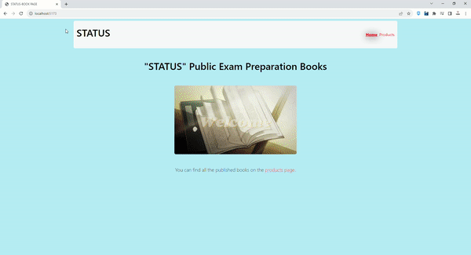

# Bookstore Website

A simple web application for browsing and searching books.



## Table of Contents

- [About](#about)
- [Technologies Used](#technologies-used)
- [Getting Started](#getting-started)
  - [Prerequisites](#prerequisites)
  - [Installation](#installation)
- [Usage](#usage)

## About

The Bookstore Website is a web application that allows users to browse and search for books. Users can view details of each book, including the author, publication year, number of pages, and a brief description.

## Technologies Used

- [React](https://reactjs.org/)
- [Axios](https://axios-http.com/)
- [React Router DOM](https://reactrouter.com/)
- [Json-server](https://github.com/typicode/json-server)
- [Bootstrap](https://getbootstrap.com/)

## Getting Started

Follow these instructions to get the project up and running on your local machine.

### Prerequisites

Before you begin, ensure you have met the following requirements:

- Node.js installed
- Git installed

### Installation

1. Clone the repository:

   ```bash
   git clone https://github.com/Advocateilker/React-Router-Dom-Project.git
   cd bookstore-website
   npm install
   npx json-server --watch db.json --port 3080
   npm start


## Usage

- Visit the homepage to see a list of books.
- Use the search bar to search for books by name.
- Click on a book to view its details.

